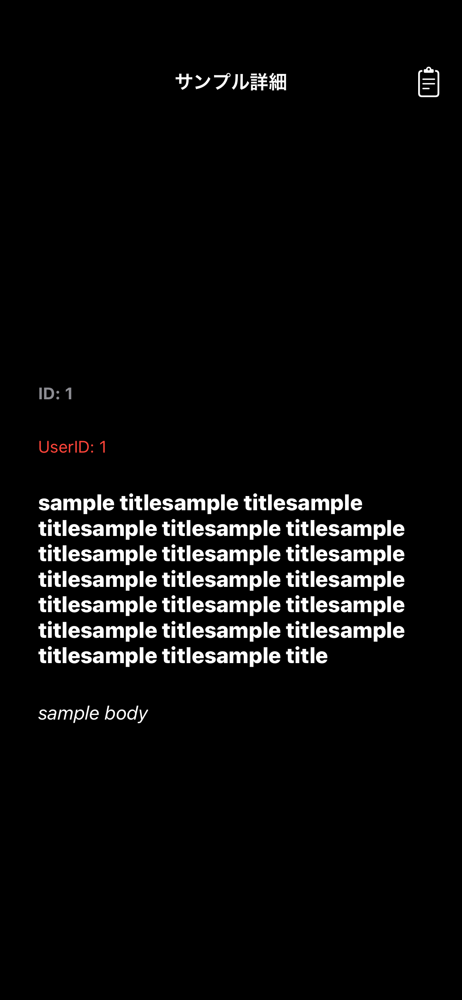
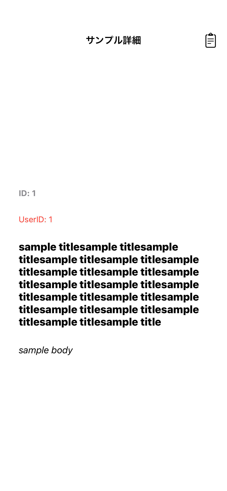
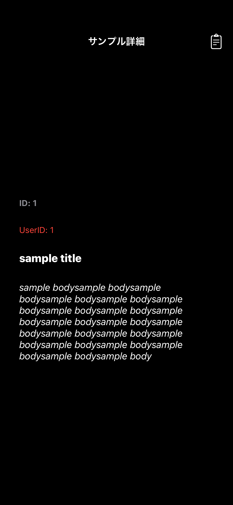
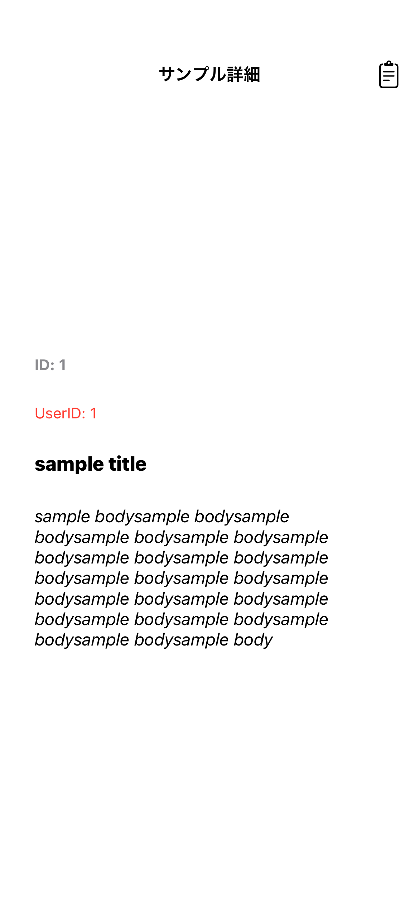
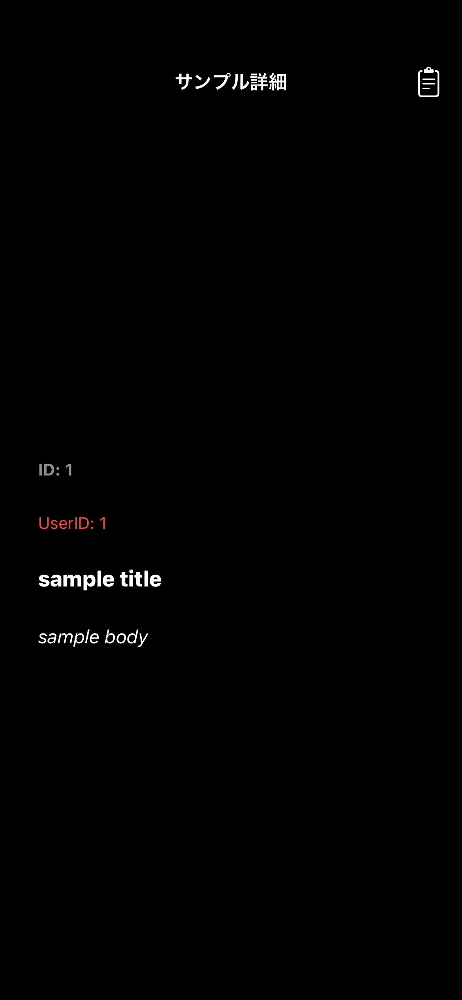
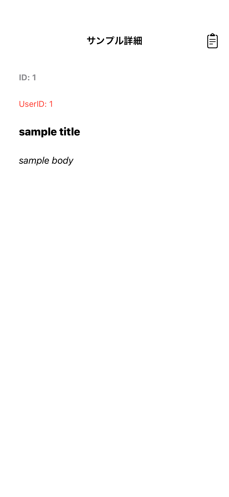

# Sample詳細画面

|タイトル内容長文ダークモード|タイトル内容長文ライトモード|
|:---:|:---:|
|16.0|16.0|
|iPhone14|iPhone14|
|||

|タイトル長文ダークモード|タイトル長文ライトモード|
|:---:|:---:|
|16.0|16.0|
|iPhone14|iPhone14|
|||

|内容長文ダークモード|内容長文ライトモード|
|:---:|:---:|
|16.0|16.0|
|iPhone14|iPhone14|
|||

|標準ダークモード|標準ライトモード|
|:---:|:---:|
|16.0|16.0|
|iPhone14|iPhone14|
|||

