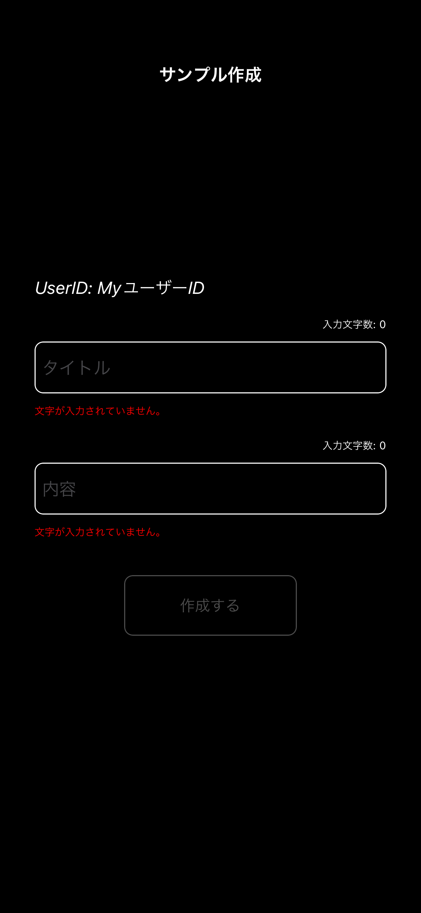
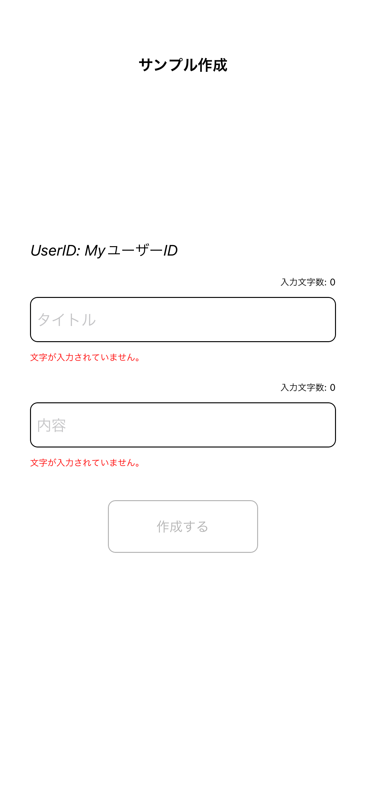
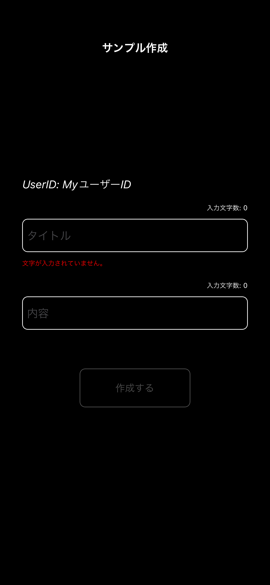
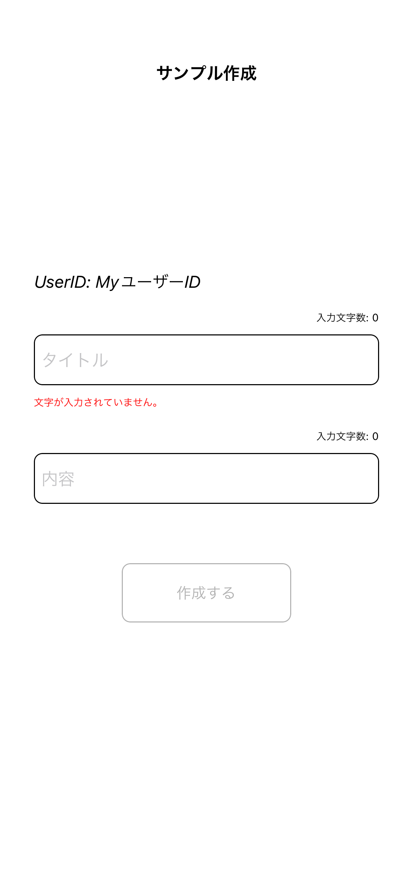
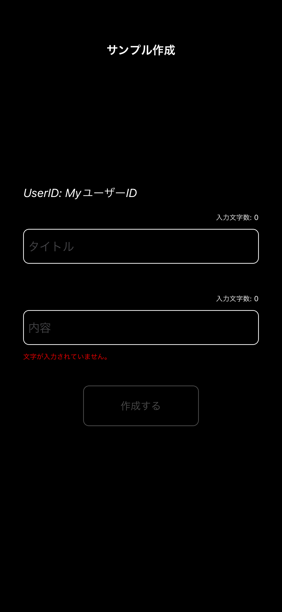
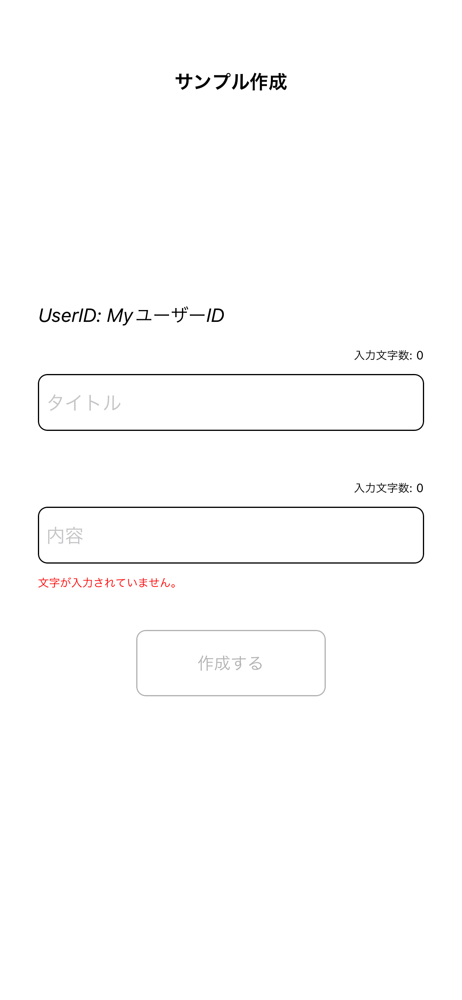
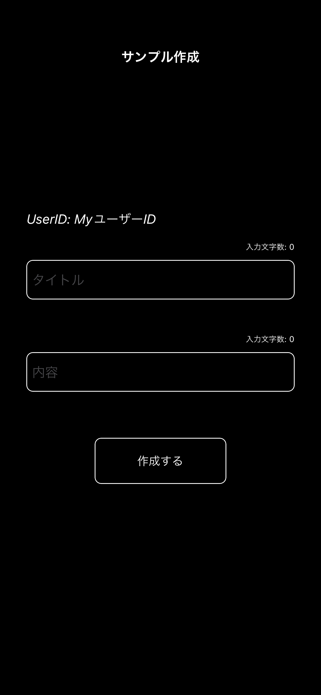
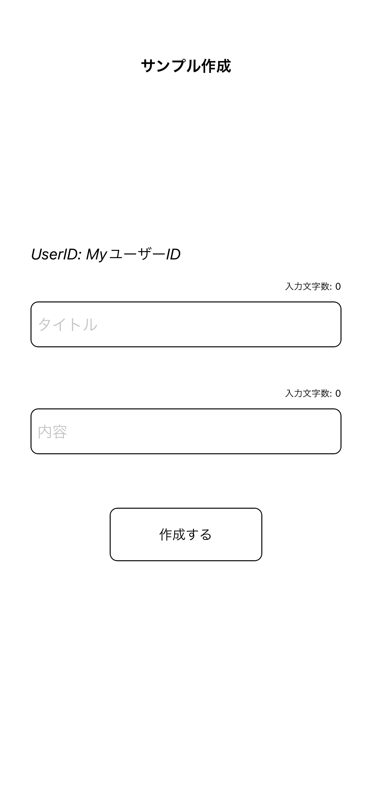
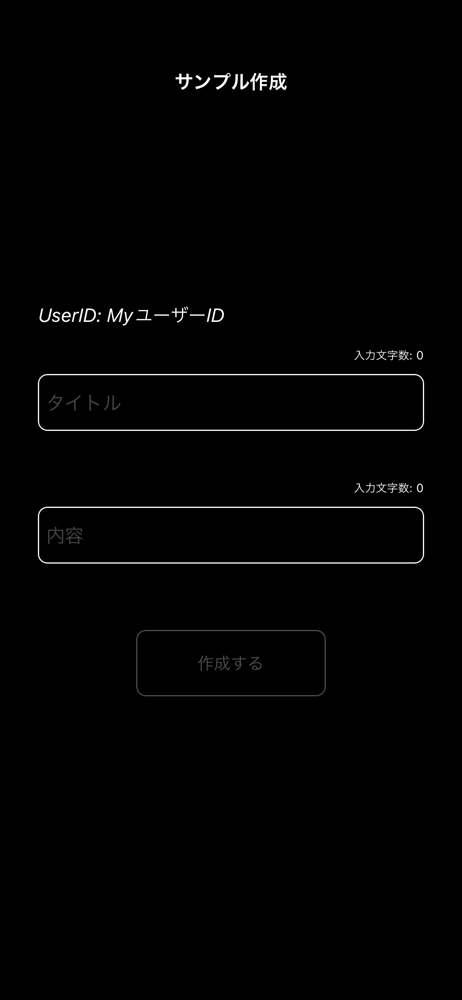
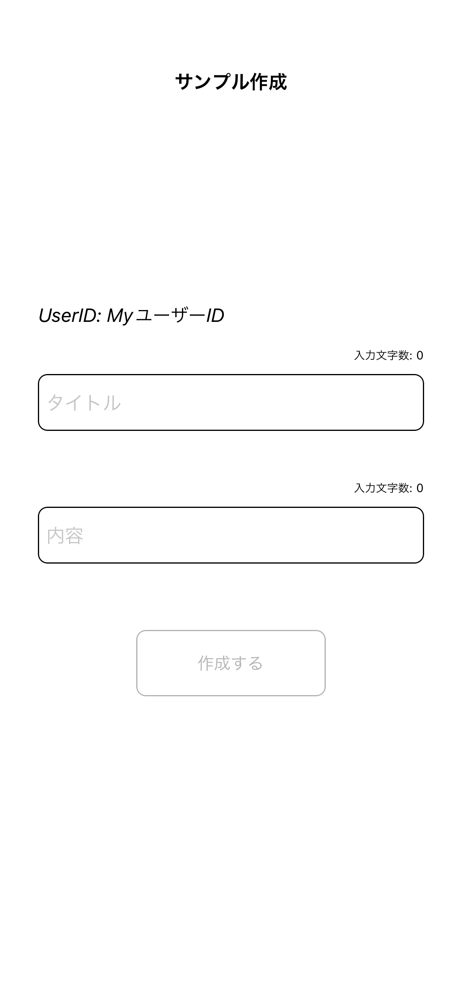

# Sample追加画面

|バリデーションタイトル内容空文字ダークモード|バリデーションタイトル内容空文字ライトモード|
|:---:|:---:|
|16.0|16.0|
|iPhone14|iPhone14|
|||

|バリデーションタイトル空文字ダークモード|バリデーションタイトル空文字ライトモード|
|:---:|:---:|
|16.0|16.0|
|iPhone14|iPhone14|
|||

|バリデーション内容空文字ダークモード|バリデーション内容空文字ライトモード|
|:---:|:---:|
|16.0|16.0|
|iPhone14|iPhone14|
|||

|作成ボタン有効化ダークモード|作成ボタン有効化ライトモード|
|:---:|:---:|
|16.0|16.0|
|iPhone14|iPhone14|
|||

|作成ボタン無効化ダークモード|作成ボタン無効化ライトモード|
|:---:|:---:|
|16.0|16.0|
|iPhone14|iPhone14|
|||

