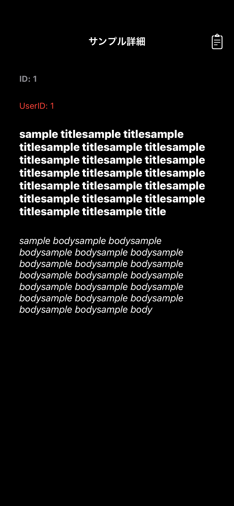
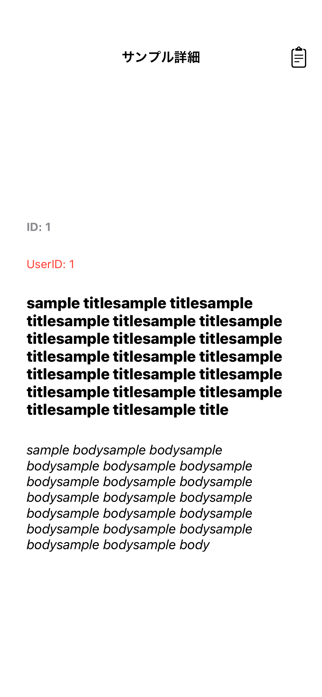

# MVVMArchitectureTemplate

## アーキテクチャ

**MVVM**

* **Model**(単体テスト対象)

* **ViewModel**(単体テスト対象)
  - **Router**(画面遷移管理)保持

* **View**

## 対象OS

* iOS14以降

## 導入ライブラリ

* **Firebase**
* **SnapKit**
* **OHHTTPStubs**
* **iOSSnapshotTestCase**
* **Mockolo**

## 導入ツール

* **SwiftFormat**
* **SwiftLint**
* **SwiftGen**
* **XcodeGen**

## プロジェクト設定

* `project.yml`内で管理、以下コマンド実行

```
make setup
```

## Snapshotテスト

* [一覧画面](https://github.com/yossibank/MVVMArchitectureTemplate/blob/main/MVVMArchitectureTemplateTests/Reports/Sample%E4%B8%80%E8%A6%A7%E7%94%BB%E9%9D%A2.md)
* [編集画面](https://github.com/yossibank/MVVMArchitectureTemplate/blob/main/MVVMArchitectureTemplateTests/Reports/Sample%E7%B7%A8%E9%9B%86%E7%94%BB%E9%9D%A2.md)
* [詳細画面](https://github.com/yossibank/MVVMArchitectureTemplate/blob/main/MVVMArchitectureTemplateTests/Reports/Sample%E8%A9%B3%E7%B4%B0%E7%94%BB%E9%9D%A2.md)
* [追加画面](https://github.com/yossibank/MVVMArchitectureTemplate/blob/main/MVVMArchitectureTemplateTests/Reports/Sample%E8%BF%BD%E5%8A%A0%E7%94%BB%E9%9D%A2.md)

※ 参考(詳細画面)

|タイトル内容長文ダークモード|タイトル内容長文ライトモード|
|:---:|:---:|
|16.0|16.0|
|iPhone14|iPhone14|
|||