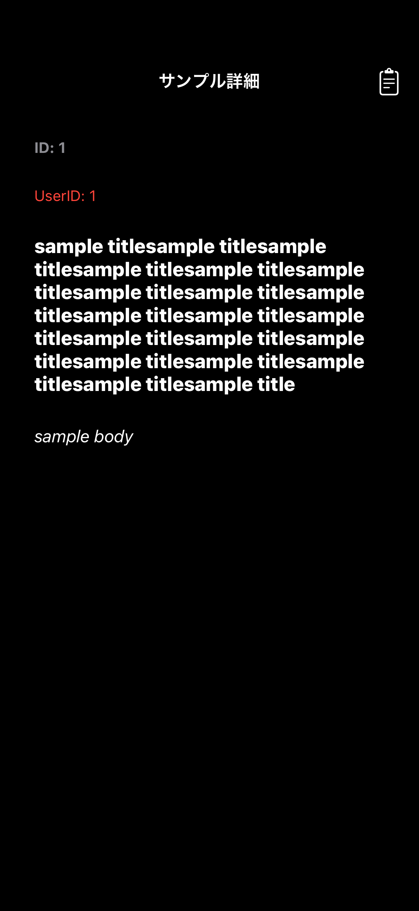
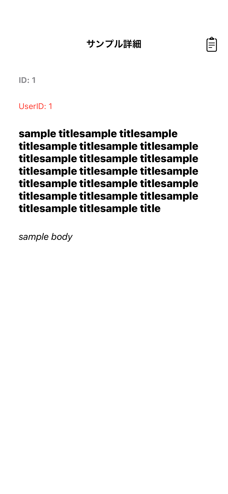

# MVVMArchitectureTemplate

       

## App Screen(Snapshot)

* [List Screen](https://github.com/yossibank/MVVMArchitectureTemplate/blob/main/MVVMArchitectureTemplateTests/Reports/Sample%E4%B8%80%E8%A6%A7%E7%94%BB%E9%9D%A2.md)
* [Edit Screen](https://github.com/yossibank/MVVMArchitectureTemplate/blob/main/MVVMArchitectureTemplateTests/Reports/Sample%E7%B7%A8%E9%9B%86%E7%94%BB%E9%9D%A2.md)
* [Detail Screen](https://github.com/yossibank/MVVMArchitectureTemplate/blob/main/MVVMArchitectureTemplateTests/Reports/Sample%E8%A9%B3%E7%B4%B0%E7%94%BB%E9%9D%A2.md)
* [Add Screen](https://github.com/yossibank/MVVMArchitectureTemplate/blob/main/MVVMArchitectureTemplateTests/Reports/Sample%E8%BF%BD%E5%8A%A0%E7%94%BB%E9%9D%A2.md)

※ Example

|タイトル長文ダークモード|タイトル長文ライトモード|
|:---:|:---:|
|16.4|16.4|
|iPhone14|iPhone14|
|||

## Target OS

* **above iOS15**

## Library

* **Firebase**
* **Mockolo**
* **OHHTTPStubs**
* **iOSSnapshotTestCase**

## Tool

* **SwiftFormat**
* **SwiftLint**
* **SwiftGen**
* **XcodeGen**

## Architecture

**MVVM + Swift Concurrency + SwiftUI**

* **Model**(Target UnitTest)
  - **Converter**

* **ViewModel**(Target UnitTest)
  - **Router**

* **View**(Target SnapshotTest)
